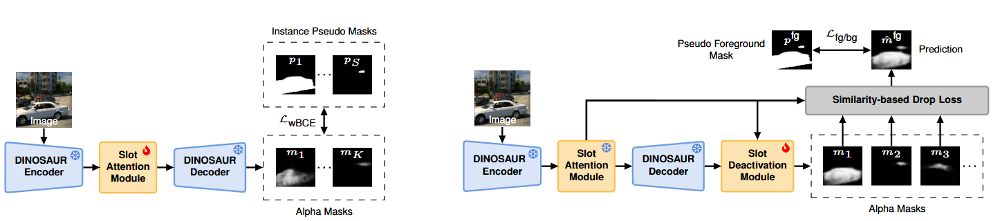

<div align="center">
<h1> Motion-Refined DINOSAUR for Unsupervised Multi-Object Discovery </h1>

[**Xinrui Gong**](https://xinruigong.github.io/)<sup>* 1</sup> [**Oliver Hahn**](https://olvrhhn.github.io)<sup>* 1</sup>    [**Christoph
Reich**](https://christophreich1996.github.io/)<sup>1,2,3,4</sup>    [**Krishnakant Singh**](https://kris-singh.github.io/)<sup>1</sup>
 [**Simone Schaub-Meyer**](https://schaubsi.github.io/)<sup>1,5 </sup> [**Daniel Cremers**](https://cvg.cit.tum.de/members/cremers)<sup>2,3,4</sup>  [**Stefan
Roth**](https://www.visinf.tu-darmstadt.de/visual_inference/people_vi/stefan_roth.en.jsp)<sup>1,4,5</sup>

<sup>1</sup>TU Darmstadt  <sup>2</sup>TU Munich  <sup>3</sup>MCML  <sup>4</sup>ELIZA  <sup>5</sup>
hessian.AI *equal contribution

[<h3>ICCVW 2025</h3>](https://ilr-workshop.github.io/ICCVW2025)

<a href="https://arxiv.org"></a> 

<a href="https://opensource.org/licenses/Apache-2.0"></a>
[](https://pytorch.org/)

<center>
    
</center>


</div>

**TL;DR:** We present MR-DINOSAUR, a fully unsupervised framework for multi-object discovery (MOD). Our method constructs pseudo labels by extracting video frames without camera motion and applying motion segmentation. Using our pseudo labels we extend the object-centric learning model DINOSAUR to unsupervised MOD. MR-DINOSAUR achieves strong performance on TRI-PD and KITTI, surpassing prior state-of-the-art methods despite being fully unsupervised.


## Abstract

Unsupervised multi-object discovery (MOD) aims to detect and localize distinct object instances in visual scenes without any form of human supervision.
Recent approaches leverage object-centric learning (OCL) and motion cues from video to identify individual objects. 
However, these approaches use supervision to generate pseudo labels to train the OCL model.
We address this limitation with MR-DINOSAUR---**M**otion-**R**efined **DINOSAUR**---a minimalistic unsupervised approach that extends the self-supervised pre-trained OCL model, DINOSAUR, to the task of unsupervised multi-object discovery.
We generate high-quality unsupervised pseudo labels by retrieving video frames without camera motion for which we perform motion segmentation of unsupervised optical flow. We refine DINOSAUR's slot representations using these pseudo labels and train a slot deactivation module to assign slots to foreground and background. 
Despite its conceptual simplicity, MR-DINOSAUR achieves strong multi-object discovery results on the TRI-PD and KITTI datasets, outperforming the previous state of the art despite being *fully unsupervised*.

## Method: MR-DINOSAUR
<center>
    
</center>

**Figure 1.** Pseudo-label generation from quasi-static frames via motion segmentation and clustering.

<center>
    
</center>

**Figure 2.** MR-DINOSAUR architecture and training overview. Stage 1 refines the DINOSAUR slot representations (left). Stage 2 learns foreground/background discrimination (right).

We propose MR-DINOSAUR, an unsupervised multi-object discovery method leveraging motion-based pseudo-labels to refine the object-centric learning model DINOSAUR. Our pipeline consists of two steps: pseudo-label generation and DINOSAUR refinement. For pseudo-label generation, we first retrieve quasi-static frames, characterized by minimal camera motion, to ensure optical flow predominantly arises from moving objects. Foreground masks are obtained by thresholding optical flow magnitudes, and connected components are partitioned into instance masks using gradient-based motion discontinuities and HDBSCAN clustering. For DINOSAUR refinement, we introduce a two-stage training scheme: first, pseudo-instance masks supervise DINOSAUR's slot-attention module to improve object segmentation; second, we propose a slot-deactivation module that distinguishes foreground from background, guided by pseudo-labels and a similarity-based drop-loss. 

## Development Setup
This project is built on the [object-centric-learning-framework](https://github.com/amazon-science/object-centric-learning-framework.git), which allows for ablations without creating duplicate code by defining models and experiments in configuration files and allowing their composition in configuration space via [hydra](https://hydra.cc/). For more information about OCLF, please refer to the [tutorial](https://amazon-science.github.io/object-centric-learning-framework/tutorial/).

Follow the steps below to install the dependencies and cli scripts to run experiments in a [poetry](https://python-poetry.org/docs/#installing-with-pipx) managed virtual environment, installing requires at least Python 3.8. 
```bash
git clone https://github.com/XinruiGong/mr-dinosaur.git
cd mr-dinosaur
conda create -n mrdinosaur python=3.8
conda activate mrdinosaur
pip install poetry==1.8.5
export PYTHON_KEYRING_BACKEND=keyring.backends.null.Keyring 
poetry install -E timm -E clip
```

### Dataset Organization
To prepare a datasets, follow this pipeline: (1) download each datasets and reorganize it into the required directory structure. In our project, we've used [KITTI](https://www.cvlibs.net/datasets/kitti/raw_data.php), [TRI-PD](https://github.com/zpbao/Discovery_Obj_Move) and [MOVI-E](https://github.com/google-research/kubric/tree/main/challenges/movi); (2) generate pseudo-labels; and (3) convert the training set, validation set, and pseudo-label set into the WebDataset format. Following, we provide an example using the KITTI dataset.

#### Dataset Download and Reorganize
Follow the steps below to install the dependencies needed for dataset download, reorganization and conversion to the WebDataset format.

```bash
cd scripts/datasets
conda create -n webdataset python=3.9
conda activate webdataset
pip install poetry==1.8.5 
poetry install
pip install imageio
bash download_and_convert.sh KITTI_pre
```

After this, the KITTI-train dataset is downloaded and reorganized into the required structure. Please also download the [KITTI-test](https://www.cvlibs.net/datasets/kitti/eval_instance_seg.php?benchmark=instanceSeg2015).
Please download the [TRI-PD](https://drive.google.com/drive/folders/1xwFF1NHtn8mbdI5qniMeswd0Ujv2uJTW) dataset shared by [DOM](https://github.com/zpbao/Discovery_Obj_Move) or refer to the [script](scripts/datasets/download_scripts/pd_download.sh).
The required folder structure is as follows.
```
Dataset/
├── Dataset_train/
│   └── camera_folder/
│       └── PNGImage/
│           ├── scene_01/
│           │   ├── XXXXXXXX.png
│           │   ├── XXXXXXXX.png
│           │   └── ...
│           └── scene_02/
│               ├── XXXXXXXX.png
│               └── ...
└── Dataset_test/
    ├── image/
    │   ├── XXXXXXXX.png
    │   ├── XXXXXXXX.png
    │   └── ...
    └── ground_truth/
        ├── XXXXXXXX.png
        ├── XXXXXXXX.png
        └── ...
```
#### Pseudo-Label Generation

To download the pretrained SMURF and RAFT model, please refer to [SMURF](https://github.com/google-research/google-research/tree/master/smurf), the [PyTorch reimplementation of SMURF](https://github.com/ChristophReich1996/SMURF), and [RAFT](https://github.com/princeton-vl/RAFT) to download the required checkpoints.

For step (2) pseudo-label generation, run the following commands to generate the labels for the KITTI dataset.

```bash
cd ../../pseudo_label_generation
conda create -n pseudo python=3.8
conda activate pseudo
pip install -r requirements.txt
python preprocess_kitti_smurf.py --compute_flow --base_input_dir "KITTI_train/image_02" --rgb_path "PNGImages_02"
python preprocess_kitti_smurf.py --compute_flow --base_input_dir "KITTI_train/image_03" --rgb_path "PNGImages_03"
```

Note: To generate pseudo-labels for the TRI-PD dataset, one needs to resize and crop the image by using the --diod_pd flag.
```
python preprocess_pd_smurf.py --compute_flow --diod_pd --base_input_dir "PD_simplified/camera_01" --rgb_path "PNGImages_01"
python preprocess_pd_smurf.py --compute_flow --diod_pd --base_input_dir "PD_simplified/camera_05" --rgb_path "PNGImages_05"
python preprocess_pd_smurf.py --compute_flow --diod_pd --base_input_dir "PD_simplified/camera_06" --rgb_path "PNGImages_06"

```
#### Convert to WebDataset
For step (3), convert the training set, validation set, and pseudo-label set into the WebDataset format, following the steps below.

```bash
cd ../../scripts/datasets
conda activate webdataset
bash download_and_convert.sh KITTI
```
Now, we can use the dataset and pseudo labels for model training and evaluation.

## MR-DINOSAUR Training & Evaluation
### Model Training

The baseline model DINOSAUR can be trained as follows:

```bash
cd ../..   # Go back to root folder
export DATASET_PREFIX=scripts/datasets/outputs
conda activate mrdinosaur
poetry run ocl_train +experiment=projects/mr_dinosaur/dinosaur_dinov2_kitti/kitti_config.yaml
```

First, we refine the slot representations in MR-DINOSAUR training stage 1:

```bash
poetry run ocl_train_sa +experiment=projects/mr_dinosaur/mr_dinosaur_dinov2_kitti/kitti_config_sa.yaml\
+load_checkpoint=path/to/dinosaur_checkpoint.ckpt
```
Next, we learn to distinguish foreground from background in MR-DINOSAUR training stage 2:

```bash
poetry run ocl_train_mlp +experiment=projects/mr_dinosaur/mr_dinosaur_dinov2_kitti/kitti_config_mlp.yaml\
+load_checkpoint=path/to/mr_stage1_checkpoint.ckpt
```

### Model Evaluation
For the evaluation of the DINOSAUR model or MR-DINOSAUR stage 1 run:

```bash
poetry run ocl_eval +evaluation=projects/mr_dinosaur/metrics_kitti_dinov2.yaml\
train_config_path=.yaml\
checkpoint_path=.ckpt\
output_dir=outputs
```

For the evaluation of the final MR-DINOSAUR model run:

```bash
poetry run ocl_eval +evaluation=projects/mr_dinosaur/metrics_kitti_mr_dinosaur_dinov2.yaml\
train_config_path=.yaml\
checkpoint_path=.ckpt\
output_dir=outputs
```

### Inference on Custom Data
Next, we provide instruction to run MR-DINOSAUR on custom data. Given images at /path/to/custom, run the following steps.
#### 1. Download the checkpoints and config files.
Download the trained checkpoints and corresponding config files from [here](https://drive.google.com/drive/folders/1-kxTO6cqkavNgDeyc_b4NWt4RWbvrTZ9?usp=drive_link), e.g. kitti_mr_stage2.ckpt and kitti_config_mr_stage2.yaml.
#### 2. Convert custom images to WebDataset format.

```bash
cd scripts/datasets
conda activate webdataset
bash download_and_convert.sh Custom /path/to/custom
```

#### 3. Run inference.
Adapt the [custom.yaml](https://github.com/XinruiGong/mr-dinosaur/blob/clear_version/configs/dataset/custom.yaml) file. Change the test_shards path and test_size in custom.yaml according to the location of the processed data and number of images to be processed. Next, run inference via:
```bash
cd ../..
conda activate mrdinosaur
poetry run ocl_eval +evaluation=projects/mr_dinosaur/inference_custom_mr_dinosaur_dinov2.yaml\
train_config_path=path/to/kitti_mr_stage2.yaml\
checkpoint_path=path/to/kitti_config_mr_stage2.ckpt\
output_dir=outputs
```

## Checkpoints
[Here](https://drive.google.com/drive/folders/1-kxTO6cqkavNgDeyc_b4NWt4RWbvrTZ9?usp=drive_link) we provide checkpoints of the trained models.

## Citation
If you find our work usefull, please consider citing the following paper.

```bibtex
@inproceedings{Gong:2025:MRD,
  author = {Xinrui Gong and 
            Oliver Hahn and 
            Christoph Reich and 
            Krishnakant Singh and 
            Simone Schaub-Meyer and 
            Daniel Cremers and 
            Stefan Roth},
  title = {Motion-Refined DINOSAUR for Unsupervised Multi-Object Discovery},
  booktitle={Proceedings of the IEEE International Conference on Computer Vision Workshops (ICCVW)},
  year  = {2025},
}
```


## Acknowledgements
The code is built on the [OCLF](https://github.com/amazon-science/object-centric-learning-framework.git) codebase, and used the pre-trained checkpoints from [DINOv2](https://github.com/facebookresearch/dinov2), [SMURF](https://github.com/google-research/google-research/tree/master/smurf) and [RAFT](https://github.com/princeton-vl/RAFT). We acknowledge the authors for their excellent work and open-sourcing their code/pre-trained models. 

*This project has received funding from the ERC under the European Union’s Horizon 2020 research and innovation programme (grant agreement No. 866008). This work has further been co-funded by the LOEWE initiative (Hesse, Germany) within the emergenCITY center [LOEWE/1/12/519/03/05.001(0016)/72] and the Deutsche Forschungsgemeinschaft (German Research Foundation, DFG) under Germany’s Excellence Strategy (EXC 3066/1 “The Adaptive Mind”, Project No. 533717223). This project was also partially supported by the European Research Council (ERC) Advanced Grant SIMULACRON, DFG project CR 250/26-1 “4D-YouTube”, and GNI Project “AICC”. Christoph Reich is supported by the Konrad Zuse School of Excellence in Learning and Intelligent Systems (ELIZA) through the DAAD programme Konrad Zuse Schools of Excellence in Artificial Intelligence, sponsored by the Federal Ministry of Education and Research. Finally, we acknowledge the support of the European Laboratory for Learning and Intelligent Systems (ELLIS). Special thanks go to Divyam Sheth for his last-minute help with the paper.*